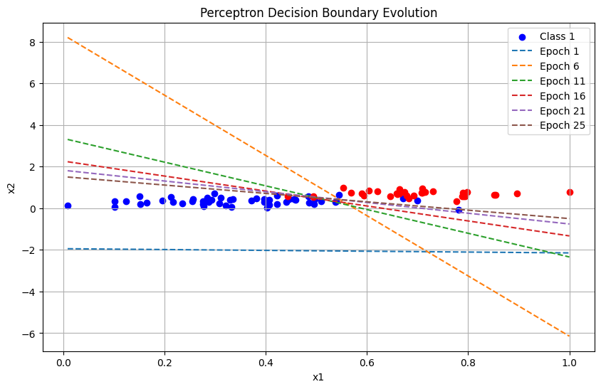

# 🚀 Perceptron From Scratch — Visualizing Linear Classification

This project is a simple yet powerful implementation of the **Perceptron Learning Algorithm**, built entirely **from scratch using NumPy**.
It trains a binary classifier on a 2D dataset and visualizes how the **decision boundary evolves** over multiple epochs.

---

## 🎯 Features

* Perceptron implemented without ML libraries
* Binary classification on a custom 2D dataset
* Visual decision boundary evolution
* Adjustable hyperparameters (epochs, learning rate)
* Simple and clean code structure
* Includes dataset + output plot

---

## 📁 Repository Structure

```
📦 perceptron-from-scratch
 ┣ 📄 DATA_W3_L2.csv        → Dataset used for training
 ┣ 📄 perceptron.ipynb      → Jupyter Notebook with full implementation
 ┣ 📄 output.png            → Decision boundary visualization
 ┗ 📄 README.md             → Project documentation (this file)
```

## 🧠 What is a Perceptron?

The **Perceptron** is one of the earliest and simplest neural network algorithms.
It learns a **linear decision boundary** that separates two classes. The decision function is:

```math
w_1x_1 + w_2x_2 + b = 0
```

During training, the model updates its weights using the rule:

```math
w = w + \eta (y - \hat{y}) x
```

Where:

* `η` — learning rate
* `y` — true label
* `ŷ` — predicted label

This update rule helps the model gradually adjust the separating line so that **misclassified points are pushed to the correct side** of the boundary.

---

## 🖥️ Output Visualization

The following image shows how the decision boundary changes over training epochs:



It helps visualize how the perceptron gradually learns a separating line.

---

## 📌 How to Run

### 1. Clone the repo

```
git clone https://github.com/Seikh05/Perceptron-from-scratch.git
cd Perceptron-from-scratch
```

### 2. Install dependencies

```
pip install numpy pandas matplotlib
```

### 3. Open the notebook

```
jupyter notebook perceptron.ipynb
```

Run all cells to train the model and generate the decision boundary plot.

---

## 📘 Learning Outcomes

Through this project, I learned:

* How linear classifiers work internally
* How weight updates affect decision boundaries
* Data visualization for classifier behaviour
* Hands-on understanding of separability & convergence
* Better intuition for gradient-based learning

---

## 📎 Related Topics

* Linear Classification
* Logistic Regression
* Gradient Descent
* Neural Networks
* Vector Math & Geometry
* Convoloutional Neural Network
---

## 🙌 Acknowledgement

This project was created as part of the Autonomus Vehicle Bootcamp by Robolearn LLP.


